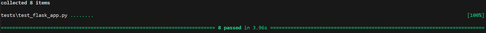

# Run flask app with individual routes
1. Setup environments and run `flask_app.py`. 
2. Interact with dataset using flask clients by individual routes.
	a. [GET] route:  run `curl http://127.0.0.1:5000/get_all_data`. And you will get all data records which match `DataFrame` requirements in the directory format from the `csv` dataset.
	b. [POST] route: run `curl -X POST -H "Content-Type: application/json" -d "{\"PUBUKPRN\": 0,\"UKPRN\": 0, \"KISCOURSEID\": 100, \"KISMODE\": 200, \"EMPPOP\": 300, \"EMPRESPONSE\": 400, \"EMPSAMPLE\": 500, \"EMPRESP_RATE\": 600, \"WORKSTUDY\": 700, \"STUDY\": 800, \"UNEMP\": 800, \"PREVWORKSTUD\": 800, \"BOTH\": 800, \"NOAVAIL\": 800, \"WORK\": 800}" http://127.0.0.1:5000/post_new_data`. And you will add the new record in the end of the `csv` dataset. Note there mustn't be empty values for all these required keys.
	c. [PUT] route: run `curl -X PUT -H "Content-Type: application/json" -d "{\"PUBUKPRN\": 0,\"UKPRN\": 0, \"KISCOURSEID\": 100, \"KISMODE\": 200, \"EMPPOP\": 300, \"EMPRESPONSE\": 400, \"EMPSAMPLE\": 500, \"EMPRESP_RATE\": 600, \"WORKSTUDY\": 700, \"STUDY\": 800, \"UNEMP\": 800, \"PREVWORKSTUD\": 800, \"BOTH\": 800, \"NOAVAIL\": 800, \"WORK\": 800}" http://127.0.0.1:5000/update_data/PUBUKPRN-10000163`.  And you will update all data records matching the input target key and the corresponding target value form the `csv` dataset. Note there mustn't be empty values for all these required keys.
	d. [DELETE] route:  run `curl -X DELETE http://127.0.0.1:5000/delete_data/PUBUKPRN-0`. And you will delete all data records matching the input target key and the corresponding target value form the `csv` dataset. Note there are not data records matching the input target key and the corresponding target value, nothing will happen.
3. Test this flask app using pytest.
	a. Install pytest.
	b. Run `pytest tests/test_flask_app.py`. And it will run all 8 test routes and print the running results.

	here is the screenshot
