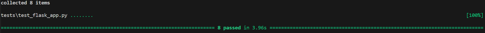

# Run flask app with individual routes
0. Tools and techniques.The github link of this work is: https://github.com/Harry460731/comp0034-cw1
1. Setup environments and run `flask_app.py`. 
2. Interact with dataset using flask clients by individual routes.
	a. [GET] route:  run `curl http://127.0.0.1:5000/get_all_data`. And you will get all data records which match `DataFrame` requirements in the directory format from the `csv` dataset.
	b. [POST] route: run `curl -X POST -H "Content-Type: application/json" -d "{\"PUBUKPRN\": 0,\"UKPRN\": 0, \"KISCOURSEID\": 100, \"KISMODE\": 200, \"EMPPOP\": 300, \"EMPRESPONSE\": 400, \"EMPSAMPLE\": 500, \"EMPRESP_RATE\": 600, \"WORKSTUDY\": 700, \"STUDY\": 800, \"UNEMP\": 800, \"PREVWORKSTUD\": 800, \"BOTH\": 800, \"NOAVAIL\": 800, \"WORK\": 800}" http://127.0.0.1:5000/post_new_data`. And you will add the new record in the end of the `csv` dataset. Note there mustn't be empty values for all these required keys.
	c. [PUT] route: run `curl -X PUT -H "Content-Type: application/json" -d "{\"PUBUKPRN\": 0,\"UKPRN\": 0, \"KISCOURSEID\": 100, \"KISMODE\": 200, \"EMPPOP\": 300, \"EMPRESPONSE\": 400, \"EMPSAMPLE\": 500, \"EMPRESP_RATE\": 600, \"WORKSTUDY\": 700, \"STUDY\": 800, \"UNEMP\": 800, \"PREVWORKSTUD\": 800, \"BOTH\": 800, \"NOAVAIL\": 800, \"WORK\": 800}" http://127.0.0.1:5000/update_data/PUBUKPRN-10000163`.  And you will update all data records matching the input target key and the corresponding target value form the `csv` dataset. Note there mustn't be empty values for all these required keys.
	d. [DELETE] route:  run `curl -X DELETE http://127.0.0.1:5000/delete_data/PUBUKPRN-0`. And you will delete all data records matching the input target key and the corresponding target value form the `csv` dataset. Note there are not data records matching the input target key and the corresponding target value, nothing will happen.
3. Test this flask app using pytest.
	a. Install pytest.
	b. Run `pytest tests/test_flask_app.py`. And it will run all 8 test routes and print the running results.

	here is the screenshot of test

4. reference
use of AI: not at all
attribution for the dataset:
The table header columns contained in the entire csv file totaled 18 items, which are: 
1.UKPRN: UK provider reference number, which is the unique identifier allocated to providers by the UK Register of Learning Providers (UKRLP) 
2.PUBUKPRN Publication UK provider reference number for where the course is primarily taught   
3.KISCOURSEID An identifier which uniquely identifies a course within a provider 
4.KISMODE The mode of the KIS course (full-time, part-time, both) (where 1 is full-time, 2 is part-time, 3 is both)  
5.EMPUNAVAILREASON Indicator of the reason why data for a course may not be available 
6.EMPPOP Number of students in the population from which the employment data is derived for the course 
7.EMPRESPONSE Number of respondents to the survey 
8.EMPSAMPLE Number of students in the survey population 
9.EMPRESP_RATE Response rate of students in the population from which the employment data is derived for the course  
10.EMPAGG Aggregation level applied to the employment data for the course  
11.EMPSBJ CAH Level subject code 
12.WORKSTUDY Proportion of students in work and/or study 15 months after their course ended  
13.STUDY Proportion of students who are undertaking further study 15 months after their course ended 
14.UNEMP Proportion of students unemployed 15 months after their course ended  
15.PREVWORKSTUD Proportion of students previously in work or study 15 months after their course ended 
16.BOTH Proportion of students in work and study 15 months after their course ended  
17.NOAVAIL Proportion of students who are not available for work or study 15 months after their course ended  
18.WORK Proportion of students in work 15 months after their course ended